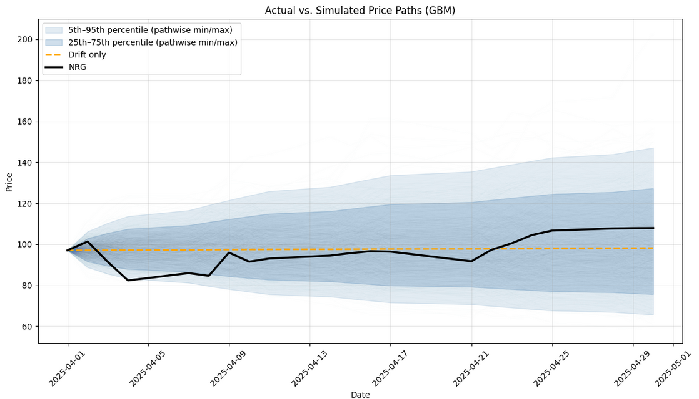
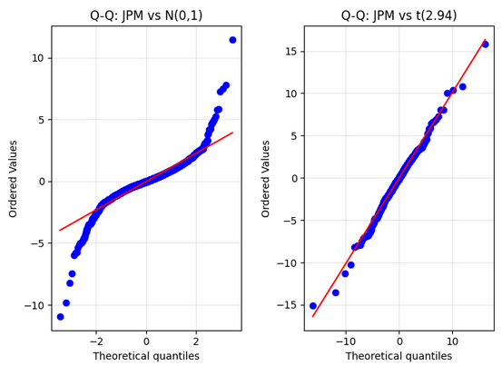

# Geometric Brownian Motion Project

-Simple exploration using Geometric Brownian Motion as a model for daily equity (large cap) closing prices

-Monte-Carlo path generation assuming normally distrubted log returns, and computation of percentile bands

-Comparison of actual log returns and fitting them against normal vs student-t distributions (QQ plots and Anderson-Darling Test)

-Llung-Box Test for volatility clustering. Then a calculation of volatility according to a t-GARCH model

-Lastly, Monte-Carlo path generation using the t-GARCH model (what not to do)

